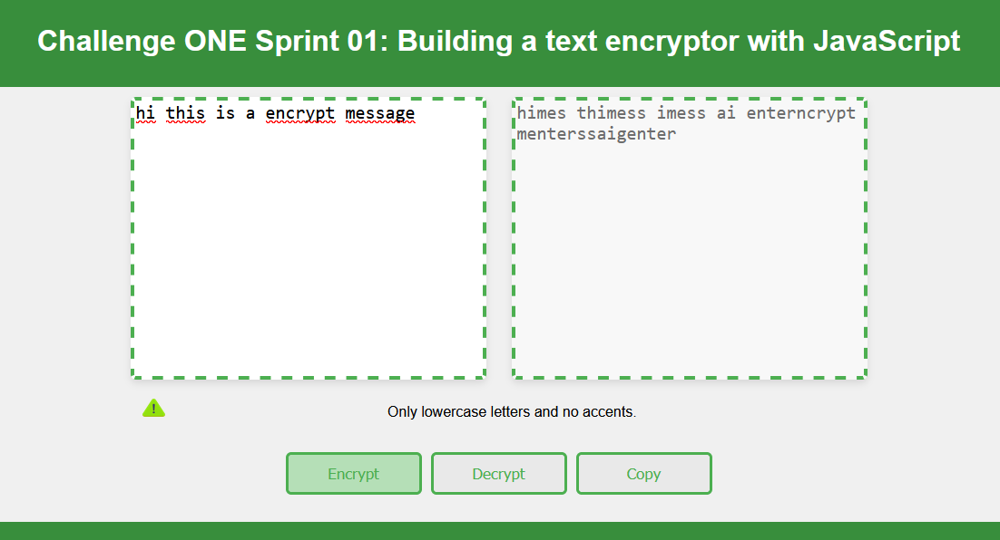

# Text-encryptor-one
🔓 Challenge ONE Sprint 01: Building a text encryptor with JavaScript – Encrypting your messages quickly and efficiently! 🔒

    

Welcome to the Text Encryptor 💻.

This project provides a simple way to encrypt your messages and data quickly and securely.

Key Features:

    Simple Interface: Our user-friendly interface allows you to encrypt text with just a few clicks.
    Open Source: This project is completely open to contributions.

Rules:
The encryption "keys" used are as follows:

    The letter "e" is converted to "enter"
    The letter "i" is converted to "imes"
    The letter "a" is converted to "ai"
    The letter "o" is converted to "ober"
    The letter "u" is converted to "ufat".
        
Requirements:

    It must work only with lowercase letters
    Accented letters and special characters should not be used
    It must be possible to convert a word to its encrypted version and also decrypt an encrypted word back to its original version.

    

   
  
Enjoy! 😜
